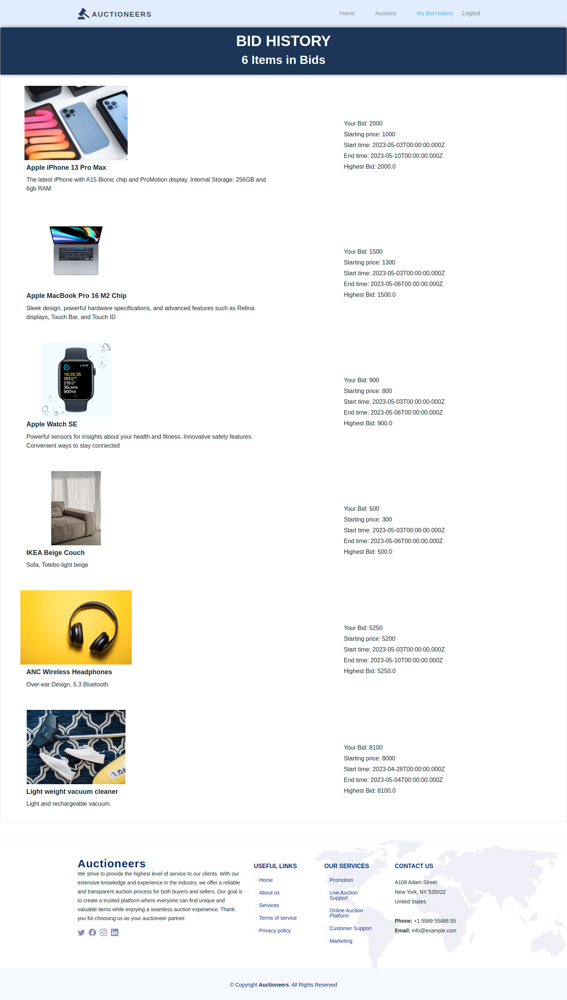

# Auctioneers App
Created by: 

---
**Authors and Contributors**
| No  |      Name      |                  Email                   |     Role      |
| :-: | :------------: | :--------------------------------------: | :-----------: |
|  1 | Emilly Tiampati  | emilly.tiampati@student.moringaschool.com |   Scrum Master  & Developer    |
|  2  | Alois Mbutura  | 	alois.mbutura@student.moringaschool.com |   Developer      |
|  3  | Daniel Njuguna  |daniel.njuguna@student.moringaschool.com |   Developer      |
|  4  | Randy Cherutich  | randy.cherutich@student.moringaschool.com |   Developer        |
|  5  | Maryann Njuguna  | maryann.njuguna@student.moringaschool.com |   Developer       |
|  6  | Kenny Saruni  | kenny.saruni@student.moringaschool.com |   Developer       |

---
## Description
The repository contains the front-end code for a bidding system web application built using ReactJS . The user interface is designed to provide a seamless and intuitive experience for both buyers and sellers, allowing buyers to easily browse products, place bids, and manage their bids. It includes all the necessary code and documentation.

[Deployed Live link](https://auctioneers.vercel.app/)

### Figma Design
[Figma](https://www.figma.com/file/lDYzrdEsl1dlzT71XGUJ9c/Auctioneer-app?t=UFEMdL6vgaC2P0jV-0)

Back end
* [Auctioneers Rails Server API Gitbub Repository ](https://github.com/sereyatiampati/Auctioneers-Rails-API)
* [Deployed live link for one of the endpoints](https://testing-e1kb.onrender.com/products) 

### Technologies used in this project:
- React
- React Router
- Bootstrap
- CSS
- HTML
- Ruby on Rails
- Bcrypt

### Setup Requirements
* Ruby 3.0.0 or higher
* Rails 6.1.0 or higher
* Postgresql
* NPM
* Node.js
* Web-browser of your choice

### How to Set up locally on your computer
1. Clone this repository `git@github.com:sereyatiampati/Auctioneers-ReactJS-Client.git`
2. Change directory  to the cloned repo `cd Auctioneers-ReactJS-Client`
3. Run `bundle install` to install the Rails API dependencies 
4. Run `rails server` to start the server
5. Run `npm install ` to install dependencies for the react frontend application
6. Run `npm run dev` to start the react frontend 

### Features

* ability to signup/register and login as buyer
* ability to signup/register and login as seller
* persistent login using tokens
* ability to add a product for auctioning as a seller
* ability to delete product as a seller
* ability to update products
* ability to close a bid before the end date as a seller
* ability to view active products available for auctioning
* ability to bid for a product
* ability to bid for a product multiple times
* ability to bid multiple products
* ability to view total number of bids placed on each product
* ability to view highest bid amount placed on each active product
* ability to view countdown timer on each active bid
* ability to filter products by category
* Users will see the winning bid once the bid is closed. 
* Winning bidder receives email notification
* Responsive design for users of different screen sizes.

## Front-end Sample Design
* Landing page

* Auctions

* Product view

* Confirm Bid

* Bid History

* Seller's Dashboard

  ### Contact
  [See contacts](https://github.com/sereyatiampati)

  Copyright © 2023. All rights reserved.

